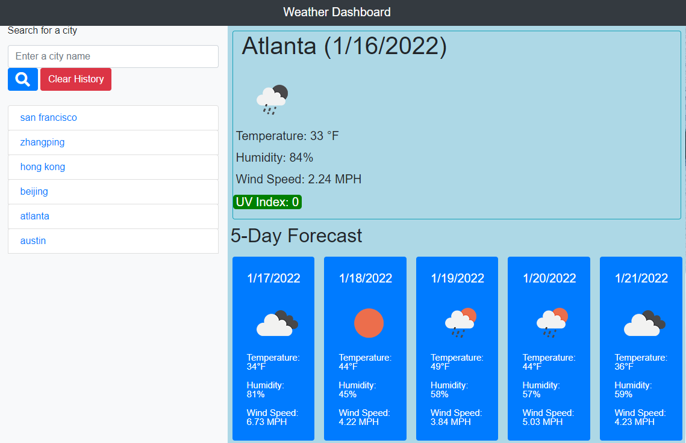

# Weather Dashboard

## Purpose
This project is to build a weather dashboard that will run in the browser and feature dynamically updated HTML and CSS.

## Getting Started

## Roadmap
* Step 1. Lay out the basic html structure. 
 This step is relatively simple. After completion of html codes, I was thinking of adding unsplash.com's photos as webpage background images, so that the users can see the photo of the city they just searched. As of 1/11/2022, I haven't received any approval notification for my APIkey application. However, I still added its radom city photo feed to the webpage as its background image. 

* Step 2. Work on the javascript file. 
  On the javascript file, at first I declares a series of variables, including the city search input, city name element, current date, weather icon, temperature, humidity and uv-index. In the beginning, I didn't read the requirements carefully, so I used native javascript to write the codes, but two days later, I realized it wasn't efficient and not met the requirements, so Istarted over from scratch. Add event listeners to the Search and Clear button. When the user doesn't enter anthing, they will receive a window alert, otherwise the getweather function will run and the search input will be pushed to the search history  
* Step 3. Sign up an account with openweather.org and get the APIs weather, forcast and icons.  
 This step is important. In this project, we need to use api to fetch data from the third-pay website. When the user searches, they will see the weather conditions of the searched city, including temperature, humidity, wind speed and UV index. UV index should be color-coded in order to show if it's favorable or not. 

* Step 4. Creates a 5-day forcast. 
 5 forcast cards will be created, showing the weather forcasts for 5 days, including the current day. 

## Screenshot
Screenshot of deployed application: 
 
Screenshot of deployed application with a photo of a random city as its background image: 

## Built With

* [HTML](https://developer.mozilla.org/en-US/docs/Web/HTML)
* [CSS](https://developer.mozilla.org/en-US/docs/Web/CSS)
* [JavaScript](https://developer.mozilla.org/en-US/docs/Web/javascript)
* [Moment.js](https://momentjs.com/docs/)
* [Bootstrap](https://getbootstrap.com/)

# Deployed Link

The link to the deployed application is: https://magickw.github.io/WeatherDashboard/

## Authors

**Baofeng Guo**

- Github： https://github.com/magickw
- LinedIn： https://www.linkedin.com/in/bfguo/

## License
This project is licensed under the MIT License

